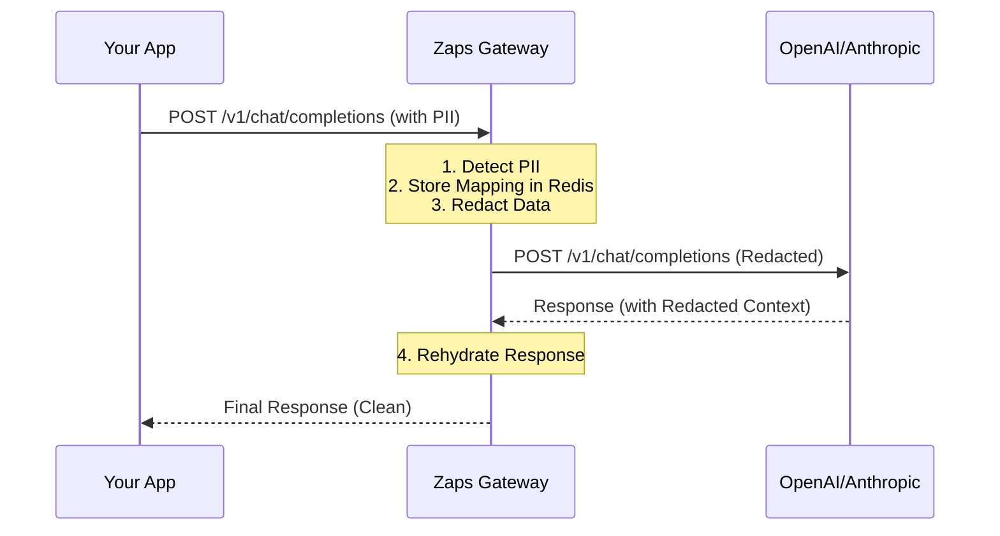

<div align="center">
  <br />
  <a href="https://zaps.ai">
    <!-- Replace with actual logo URL if available, using text for now -->
    <h1>⚡ Zaps.ai</h1>
  </a>
  
  <p align="center">
    **The High-Performance PII Redaction Gateway for LLMs**
  </p>

  <p align="center">
    <a href="https://goreportcard.com/report/github.com/zapsai/zaps-gateway">
      
    </a>
    <a href="https://github.com/zapsai/zaps-gateway/blob/main/LICENSE">
      
    </a>
    <a href="https://github.com/zapsai/zaps-gateway/releases">
      
    </a>
    <a href="https://discord.gg/zaps">
      
    </a>
  </p>
</div>

<br />

## 🚀 Overview

**Zaps** is an open-source, high-performance API gateway that sits between your applications and LLM providers (OpenAI, Anthropic, etc.). It automatically detects and redacts Personally Identifiable Information (PII) in real-time, ensuring your customer data never leaves your infrastructure in plain text.

> "Stop sending customer secrets to AI companies."

## ✨ Features

| Feature | Description |
| :--- | :--- |
| **⚡ Ultra-Low Latency** | Built in **Go**, adding **< 10ms** overhead to your requests. |
| **🔒 100% Stateless** | No data is stored. PII is redacted in-memory and rehydrated on response. |
| **🐳 Docker Native** | Deploy anywhere with a single container. Kubernetes ready. |
| **🛡️ Smart Redaction** | Detects Email, Phone, SSN, Credit Cards, and API Keys automatically. |
| **📦 Multi-Tenant** | Built-in isolation for distinct teams or customers. |
| **📊 Audit Logs** | Complete visibility into what data was redacted (without storing the data). |

## 🛠️ Quick Start

Get up and running in seconds with Docker.

```bash
docker run -p 3000:3000 \
  -e DATABASE_URL=postgres://user:pass@db:5432/zaps \
  -e REDIS_URL=redis:6379 \
  zapsai/zaps-gateway
```

Or clone and run with Docker Compose:

```bash
git clone https://github.com/zapsai/zaps-gateway.git
cd zaps-gateway
docker-compose up -d
```

Your gateway is now running at `http://localhost:3000`.

## 📚 Documentation

Detailed documentation for developers and operators.

- **[Deployment Guide](docs/deployment.md)** - Production setup, env vars, and security.
- **[API Reference](docs/api.md)** - Endpoints for chat, completion, and administration.
- **[Development](docs/development.md)** - Building from source and contributing.

## 🏗️ Architecture

Zaps functions as a transparent proxy.



## 🤝 Contributing

We welcome contributions! Please see our [Development Guide](docs/development.md) for how to get started.

1. Fork the Project
2. Create your Feature Branch (`git checkout -b feature/AmazingFeature`)
3. Commit your Changes (`git commit -m 'Add some AmazingFeature'`)
4. Push to the Branch (`git push origin feature/AmazingFeature`)
5. Open a Pull Request

## 📄 License

Distributed under the MIT License. See `LICENSE` for more information.

---

<div align="center">
  <p>Built with ❤️ by the Engineering Team at <a href="https://zaps.ai">Zaps.ai</a></p>
</div>
